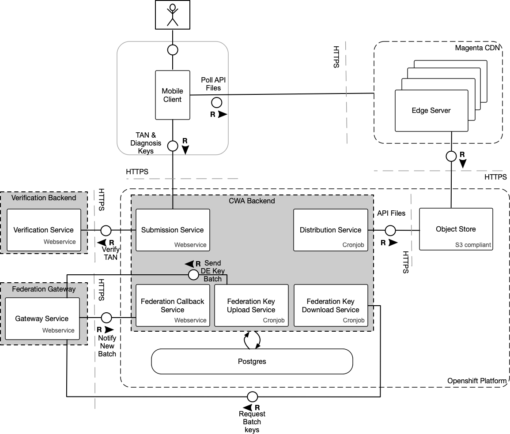

# CWA-Server Architecture

This document outlines the CWA server architecture on high level. This document
does not necessarily reflect the current implementation status in this repository, as development
is still ongoing. Also, details of the exposure notification API by Google/Apple might change
in the future.

The high level overview of CWA can be found in the [cwa-documentation](https://github.com/corona-warn-app/cwa-documentation)
repository. The [solution architecture](https://github.com/corona-warn-app/cwa-documentation/blob/master/solution_architecture.md)
is outlined in detail.

The above illustration shows all components of the CWA project. This repository reflects the `Corona-Warn-App Server`
component, which can be found in the left bottom corner. This document explains in more detail how this component
functions and interacts with other components.

## Overview

The Corona Warn App ("CWA") server runs as a set of cron jobs and services exposing API's deployed within a Kubernetes cluster.
Its main objective is to enable users to take part in the exposure notification framework based
on Apple/Google specifications. Although CWA aims at compliance to the spec on a protocol level, it
does not mean automatically that all features will be implemented. Main driver for these assessments is data privacy and protection (DPP) concerns.

Find the latest specifications of Google/Apple here:

- [Exposure Key Export File Format and Verification](https://static.googleusercontent.com/media/www.google.com/en//covid19/exposurenotifications/pdfs/Exposure-Key-File-Format-and-Verification.pdf)
- [Setting Up an Exposure Notification Server (Apple)](https://developer.apple.com/documentation/exposurenotification/setting_up_an_exposure_notification_server?changes=latest_beta)
- [Apple Framework Specifications](https://developer.apple.com/documentation/exposurenotification?changes=latest)
- [Google Framework Specifications (1.3.2)](https://static.googleusercontent.com/media/www.google.com/en//covid19/exposurenotifications/pdfs/Android-Exposure-Notification-API-documentation-v1.3.2.pdf)
On a high level, the application consists of two main parts, as shown below.

1. CWA Server: Handles the following tasks:
    - accepting submission of new keys
    - aggregation/distribution of diagnosis keys and configuration files
    - uploading and downloading keys to/from the federation gateway to enable interoperability with other EU nations
2. Verification Server: Deals with test result retrieval and verification (including issuing TANs).
The components regarding the verification are managed and deployed separately.
3. Federation Gateway: Enables the sharing of keys across integrated app backends of nations within the European Union

This document outlines the CWA Server components, which are part of this repository. For the full architectural
overview, check out the [solution architecture](https://github.com/corona-warn-app/cwa-documentation/blob/master/solution_architecture.md).

## Integration with Other Systems

### Object Store

All mobile app relevant files will be stored on the S3 Object Store. Those files are:

- Aggregated files containing the diagnosis keys, which were reported in a specific interval (e.g. hourly). These are organized into country specific buckets.
- Daily aggregated files containing the diagnosis keys, which were reported for the respective days. These are organized into country specific buckets.
- Configuration files containing the [exposure configuration](https://developer.apple.com/documentation/exposurenotification/enexposureconfiguration) and CWA mobile app config.
- Additional files regarding meta information of available files/structures/etc.

The files will be pushed to an S3 compliant object store whenever new files become available. File structure definitions for those files can be found in the respective Services chapter.

The mobile application will use a CDN for fetching files, which mirrors all files as a transparent proxy present in the object store.

### Verification Server

The verification server supports the user's journey beginning at scanning the QR code printed
on the documentation of the SARS-CoV-2 test until the upload of diagnosis keys when the user was tested positive. Testing
labs will provide the results of SARS-CoV-2 tests to the [test result server](https://github.com/corona-warn-app/cwa-testresult-server),
which in turn provides an interface to the [verification server](https://github.com/corona-warn-app/cwa-verification-server).
Since the GUID contained in the QR code is linked to a test, the mobile application is able to fetch the results from
the verification server and provide a notification to the user. After users have given their consent to upload their diagnosis key,
a TAN is fetched from the verification server. This TAN will be used as an authorization token when
the user uploads the diagnosis keys of the past 14 days.

Therefore, from a CWA Server perspective, the Verification Server provides an endpoint for TAN verification.

A detailed description of the process can be found in the chapter ["Retrieval of lab results and verification process"](https://github.com/corona-warn-app/cwa-documentation/blob/master/solution_architecture.md#retrieval-of-lab-results-and-verification-process) of the solution architecture document.

### Federation Gateway

Many countries are developing proximity tracing apps to reduce the spreading of COVID-19, generally using the Exposure Notifications API from Google and Apple. While these national solutions reflect the specifics of each country a solution is required to allow interoperability between those national solutions. This software implements a pan-European solution a "European Federation Gateway Service" allowing a national backend to upload keys of newly infected people and download the diagnosis keys from the other countries participating in this scheme. The integration with the Federation Gateway supports an approach called the "Country of Interest" which dictates that:

- Newly submitted keys must be shared with a listing of countries which the user may have visited prior (visitedCountries)
- An approach to download keys to the device based on a selection of countries which are applicable for the user. Meaning the distribution will generate country specific archives allowing the mobile application to download targeted sets of keys per country that is relevant for the user.
- Additionally, the CWA Server will provide a full EUR archive which contains all of the keys from all involved countries

From a CWA-SERVER perspective, the Federation Gateway provides a set of API's with which we need to integrate in order to enable the following:

- Upload of applicable DE keys
- Download of connected (non-DE) country keys
- Auditing of download keys for signature verification
- Callback notification process for Federation Gateway to notify CWA-SERVER that new download batches are available. Note: This is not implemented in the initial release of the federation gateway integration and would potentially come at a later point in time.

Details of the Federation Gateway itself can be found in the following locations:

- [efgs-federation-gateway github repository](https://github.com/eu-federation-gateway-service/efgs-federation-gateway)
- [eHealth Network Guidelines](https://ec.europa.eu/health/sites/health/files/ehealth/docs/mobileapps_interoperabilitydetailedelements_en.pdf)

## Security

### Endpoint Protection

The CWA Server exposes only one endpoint – the submission endpoint.
The endpoint is public (unauthenticated), and authorization for calls is granted to users who are passing a valid TAN.
The TAN verification cannot be done on CWA Server, but the task is delegated to the verification server (see Verification Server chapter in *Integration with other Systems*).

### Authenticity to CDN

All files published by CWA will be digitally signed by CWA.
This ensures that clients can trust the file they have received from the third-party CDN.

The [protocol buffer](https://developers.google.com/protocol-buffers) files from Google/Apple already specify how signing should work. Each diagnosis key aggregate file
is a zip file, containing two files - one carries the actual payload. The other one carries signature information.

CWA is be required to share the public key with Google/Apple, so that the API on the mobile client
is able verify against it.

### Authenticity to Federation Gateway

The requirements for authenticity to the Federation gateway are outlined in the [eHealth Network Guidelines](https://ec.europa.eu/health/sites/health/files/ehealth/docs/mobileapps_interoperabilitydetailedelements_en.pdf) and pertain to how the CWA Backend must interact with the service. These guidelines discuss:

- How to verify the integrity of the data downloaded within each batch. This is discussed in section 5.7 Audit Interface.
- How country backend servers are intended to interact and authenticate themselves to the Federation Gateway. This is covered section 6 Security and talks about the process for handling certificates, mTLS, and communication protocols of HTTP(s)

The CWA Server for Upload and Download will adhere to these guidelines in order to facilitate a proper integration.

### Fake Submissions (Plausible Deniability)

In order to protect the privacy of the users, the mobile app needs to send dummy submissions from time to time.
The server accepts the incoming calls and treats them the same way as regular submissions.
The payload and behavior of dummy and real requests must be similar, so that 3rd parties are unable to differentiate between those requests.
If a submission request marked as a dummy is received by the server, the caller will be presented with a successful result.
The CWA server does not persist the entry on the database and ensures that dummy and real requests take the same amount of total response time, e.g. by delaying the response to the client, if necessary.

## Services

- [Submission Service](./SUBMISSION.md)
- [Distribution Service](./DISTRIBUTION.md)
- [Federation Upload Service](./FEDERATION-UPLOAD.md)
- [Federation Download Service](./FEDERATION-DOWNLOAD.md)
