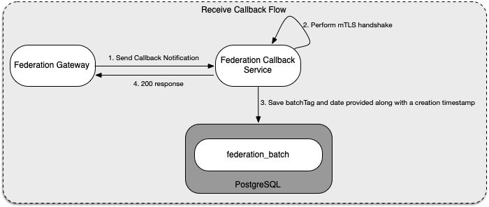

# CWA Federation Callback Service

This service will expose an API which is registered with the federation gateways callback service API to accept the callback notifications.
The role of this service is to validate the certificates (mTLS handshake) and then store the notification info (batchTag and date) into the postgres database for future processing by the federation key download job.
For further information on the processing of those notifications (FederationBatchInfo) refer to the documentation of the [Download service](FEDERATION-DOWNLOAD.md).



## External Dependencies

- **Vault**: Used for secrets and certificate storage
- **RDBMS**: PostgreSQL as the persistent storage for notifications

## Environment Variables

Callback has no service-specific environment variables.

## Spring Profiles

Spring profiles are used to apply federation key download service configuration based on the running environment, determined by the active profile.

You will find `.yaml` and `.xml` based profile-specific configuration files at [`/services/callback/src/main/resources`](/services/callback/src/main/resources).

### Available Profiles

Profile                                           | Effect
--------------------------------------------------|-------------
`debug`                                           | Sets the log level to `DEBUG` and changes the `CONSOLE_LOG_PATTERN` used by Log4j 2.
`cloud`                                           | Removes default values for the `spring.flyway`, `spring.datasource` and sets federation gateway contexts
`disable-callback-cert-auth`                      | Disables certificate authentication for the Callback endpoint.
`disable-ssl-client-postgres`                     | Disables SSL with a pinned certificate for the connection to the postgres.
`disable-ssl-server`                              | Disables SSL for the Callback endpoint.

Please refer to the inline comments in the base `application.yaml` configuration file for further details on the configuration properties impacted by the above profiles.

## CallbackController

REST-controller that handles incoming GET-requests. Constructs new FederationBatchInfos from received parameters and triggers persistence of those.
All other requests are being denied - configured in `SecurityConfig.java`.

## ApiExceptionHandler

Responsible for general error handling within the callback service.

## Data Model

The callback service will insert new entries (batch tag and date information) specified within the HTTP request into the table mentioned below. This information will then be further processed by the federation key download job.

```sql
    CREATE TABLE federation_batch (
        batch_tag   varchar(20) PRIMARY KEY,
        date        date NOT NULL,
        status      varchar(20)
);
```

## Federation Gateway Requirements on the Callback API

The federation gateway expects callback API's to have a specific API and specific authentication mechanisms:

- The Federation Gateway Service performs mutual authentication with the national backends. This means the API validates the provided server certificate of the national backend and provides its identity as a client certificate to them. Each national backend has to explicitly allow this identity and has to provide a server certificate public key to the Federation Gateway Service for allow-listing.
- The Federation Gateway will send a **GET** request to the callback service and provide the following attributes as query parameters:
  - `batchTag: type string`: Represents the ID of the batch
  - `date` type date: The day from which the batch is available IE: `04-03-2020`
