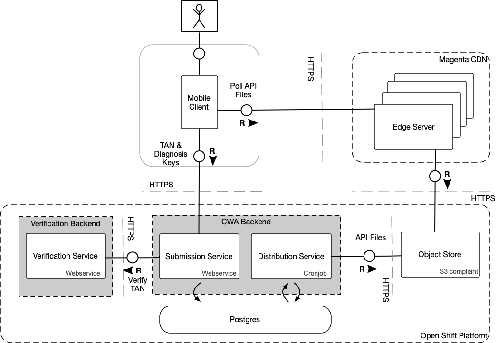

# Architecture CWA Backend

This document outlines the CWA backend architecture on high level. This document
does not necessarily reflect the current implementation status in this repository, as there are
still frequent changes to the exposure notification API by Google/Apple.

## Overview

The Corona Warn App ("CWA") server runs in a Kubernetes cluster on the Open Shift (“OSP”) platform.
Its main objective is to enable users to take part in the exposure notification framework based
on Apple/Google specifications. Although CWA aims at compliance to the spec on a protocol level, it
does not mean automatically that all features will be implemented. Main driver for these assessments is data privacy and protection (DPP) concerns.

Find the latest specifications of Google/Apple here:

- [Google Spec](https://static.googleusercontent.com/media/www.google.com/en//covid19/exposurenotifications/pdfs/Exposure-Key-File-Format-and-Verification.pdf)
- [Apple Spec](https://developer.apple.com/documentation/exposurenotification/setting_up_an_exposure_notification_server?changes=latest_beta)

On a high level, the application consists of two main parts, as shown below.



1. CWA Backend: Handles submission and aggregation/distribution of diagnosis keys and configuration files.
2. Verification Backend: Deals with test result verification and issues TANs. This backend is managed and deployed
separately. The repository for those components will be opened up to the community soon.

This document outlines the CWA backend components, which are part of this repository. For the full architectural
overview, check out the [solution architecture](https://github.com/corona-warn-app/cwa-documentation/blob/master/solution_architecture.md).

## Integration with Other Systems

### Object Store

All mobile app relevant files will be stored on the S3 Object Store. Those files are:

- Aggregated files containing the diagnostic keys, which were reported in a specific interval (e.g. hourly).
- Daily aggregated files containing the exposure keys, which were reported for the respective days.
- Configuration files containing the [exposure configuration](https://developer.apple.com/documentation/exposurenotification/enexposureconfiguration) and CWA mobile app config.
- Additional files regarding meta information of available files/structures/etc.

The files will be pushed to an S3 compliant object store whenever new files become available. File structure definitions for those files can be found in the respective Services chapter.

The mobile application will use a CDN for fetching files, which mirrors all files as a transparent proxy present in the object store.

### Verification Backend

Note: The verification backend design will be available soon as discussions are ongoing.

The verification backend supports the user's journey beginning at scanning the QR code printed
on the documentation of the SARS-CoV-2 test until the upload of diagnosis keys when the user was tested positive. Testing
labs will update the Verification Backend when a SARS-CoV-2 test result is positive. Since the QR code
is linked to a test, the mobile application will be able to fetch a test-positive notification from
the Verification Backend, along with a TAN. The TAN will be used as an authorization token when
the user uploads the diagnosis keys of the past 14 days.

Therefore, from a CWA Backend perspective, the Verification Backend provides an endpoint for TAN verification.

## Security

### Endpoint Protection

The CWA backend exposes only one endpoint – the submission endpoint.
The endpoint is public (unauthenticated), and authorization for calls is granted to users who are passing a valid TAN.
The TAN verification cannot be done on CWA backend, but the task is delegated to the Verification Backend (see Verification Backend chapter in Integration with other Systems).

### Authenticity

All files published by CWA  will be digitally signed by CWA.
This ensures that clients can trust the file they have received from the third-party CDN.

The proto files from Google/Apple already specify how signing should work. Each diagnosis key aggregate file
will be a zip file, containing two files - one carries the actual payload. The other one carries signature information.

CWA will be required to share the public key with Google/Apple, so that the API on the mobile client
will be able verify against it.

### Fake Submissions

In order to protect the privacy of the users, the mobile app needs to send fake submissions from time to time.
The server accepts the incoming calls and will treat them the same way as regular submissions.
The payload and behavior of fake and real requests must be similar, so that 3rd parties are unable to differentiate between those requests.
If a submission request marked as fake is received by the server, the caller will be presented with a successful result.
The CWA backend will not persist the entry on the database and will ensure that fake and real requests take the same amount of total response time, e.g. by delaying the response to the client, if necessary.

## Services

### Submission Service

The submission service's only task is to process uploaded diagnosis keys and persist them to the database after the TAN has been verified.
The actual task of the verification is handed over to the verification backend, which will provide the verification result back to CWA.
After verification was successfully done, the diagnosis keys are persisted in the database, and will be published in the next batch.

The payload send by the mobile is defined as:

```protobuf
message SubmissionPayload {
  repeated Key keys = 1;
}

message Key {
  bytes keyData = 1; // Key of infected user
  uint32 rollingStartIntervalNumber = 2; // Interval number when the key's EKRollingPeriod started.
  uint32 rollingPeriod = 3; // Number of 10-minute windows between key rolling.
  int32 transmissionRiskLevel = 4; // Risk of transmission associated with the person this key came from.
}
```

Additionally, the endpoint requires the following headers to be set:

```http
CWA-Authorization: TAN <TAN>
CWA-Fake: <0 or 1>
```

There is currently no official specification for publishing diagnosis keys to the server.
Google currently uses the following in their reference implementation.

[exposure_model.go](https://github.com/google/exposure-notifications-server/blob/master/internal/database/exposure_model.go)

```golang
type Publish struct {
    Keys                      []ExposureKey `json:"temporaryExposureKeys"`
    Regions                   []string      `json:"regions"`
    AppPackageName            string        `json:"appPackageName"`
    Platform                  string        `json:"platform"`
    DeviceVerificationPayload string        `json:"deviceVerificationPayload"`
    VerificationPayload       string        `json:"verificationPayload"`
    Padding                   string        `json:"padding"`
}
```

As of this moment, due to DDP concerns it is unclear whether the device attestation-related fields are in scope of CWA.

### Distribution Service

The distribution service's objective is to publish all CWA-related files to the object store, from which
the clients will fetch their data from. There are three types of files.

#### Key Export

Key Export files are files, which hold published diagnosis keys from SARS-CoV-2 positive tested users.
These files are based on the specification of Google/Apple and are generated in regular intervals.
Each interval generates a `.zip` file, containing two files:

1. export.bin: Contains the list of diagnosis keys.
2. export.sig: Contains signature information needed for validating the export.bin file.
The file structure definition can be found [here](https://github.com/google/exposure-notifications-server/blob/master/internal/pb/export/export.proto).

The distribution service is triggered by a CRON scheduler, currently set to 1 hour. However, this
will change, since the Google/Apple API will have rate-limiting in place for a maximum of 15 checks
per day.

In case there is an insufficient number of diagnosis keys for the target interval available, the
creation of the file will be skipped in order to prevent attackers from being potentially able to
de-obfuscate individuals.

Another alternative is to put fake diagnosis keys into the payload, which would serve the same purpose.
In that case, it needs to be guaranteed, that those fake diagnosis keys are indistinguishable from real ones.

#### Configuration

Configuration files are needed for two use cases:

1. Exposure Configuration: In order to calculate a risk score for each exposure incident, the mobile
API requires a list of the following parameters, requiring weights and levels: duration, days, attenuation and transmission.
The function and impact of those parameters is described on the [Apple Exposure Configuration Page](https://developer.apple.com/documentation/exposurenotification/enexposureconfiguration).
2. Mobile App Configuration: Provides configuration values needed for the CWA mobile app, which are
not part of the exposure notification framework. These values are required for controlling the
application behavior.

#### Discovery

Files on CWA may be discovered with the help of index files. There will be one central index file,
containing all available key export files on the server, separated by new-line.
The index will be regenerated whenever new export files are distributed to the object store.

## Data Retention

The retention period is set to 14 days. Therefore, all keys whose _submission date_ is older than 14 days are removed from the system. This includes the persistency layer, as well as CDN/object store published files.
The retention mechanism is enforced by the Distribution Service.
